# PES-VCS Lab Submission

**Name:** K B Balavideshna 
**SRN:** PES1UG24CS206 
**Course:** UE24CS242B

---

## Required code files
object.c:	Object store implementation
tree.c:	Tree serialization and construction
index.c:	Staging area implementation
commit.c:	Commit creation and history walking

---

## Screenshots

### Phase 1
- Screenshot 1A
  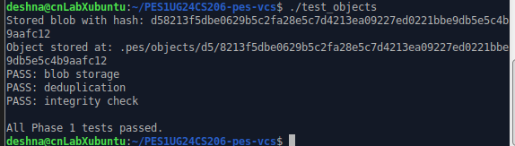
- Screenshot 1B
  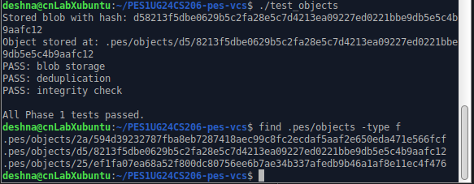

### Phase 2
- Screenshot 2A
  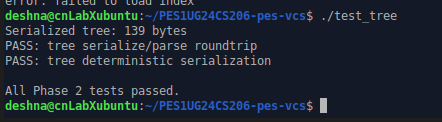
- Screenshot 2B
  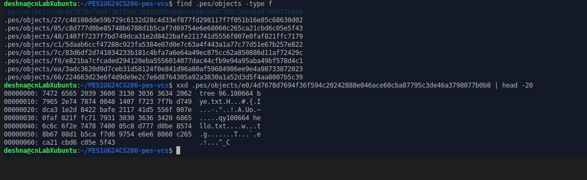

### Phase 3
- Screenshot 3A
  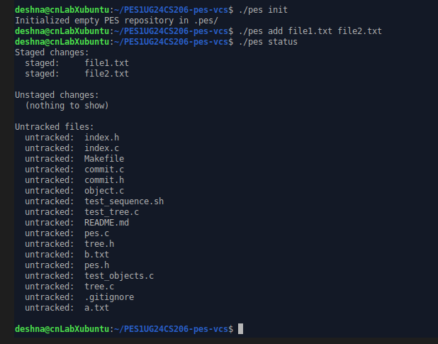
- Screenshot 3B
  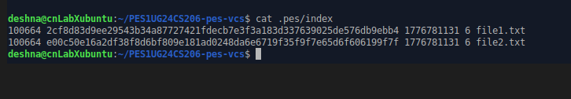

### Phase 4
- Screenshot 4A
  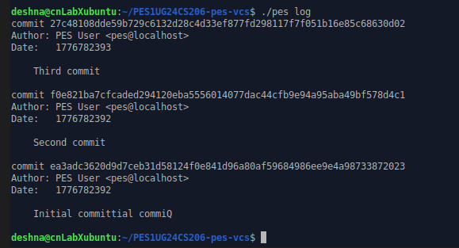
- Screenshot 4B
  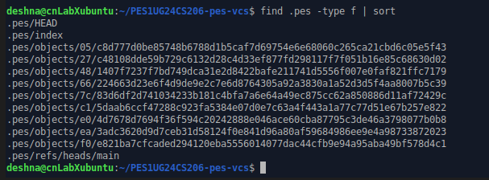
- Screenshot 4C
  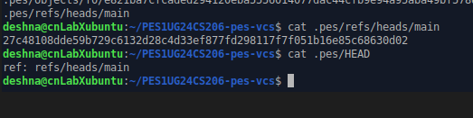

### Final screenshots
  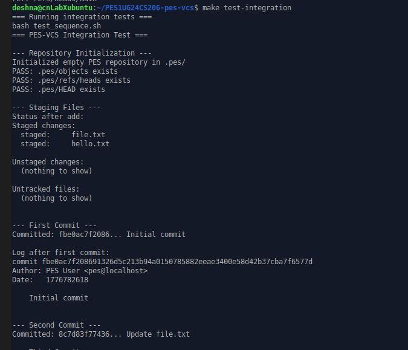
  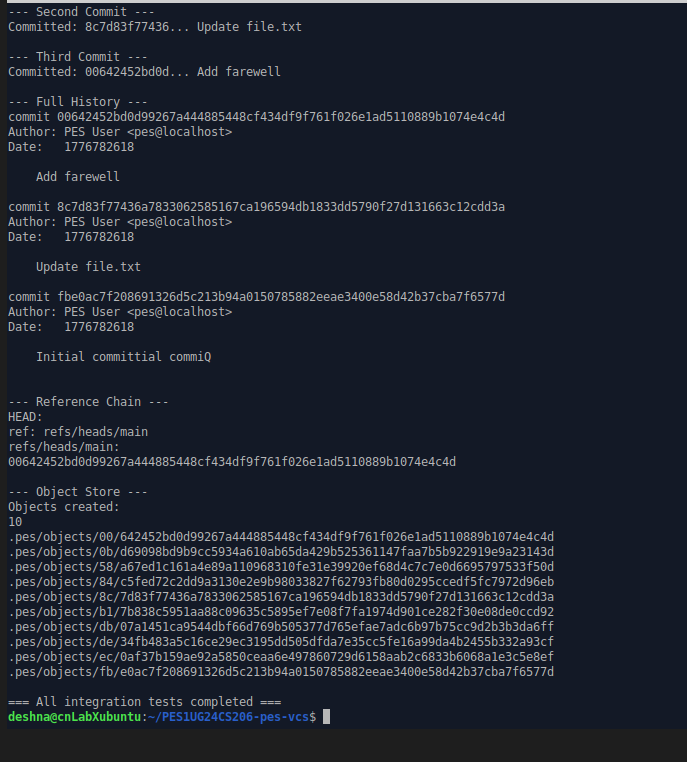
  
---

## Questions

### Q5.1
A branch in this system is simply a file inside .pes/refs/heads/ that stores the latest commit hash. The HEAD file points to one of these branches. So, implementing pes checkout <branch> mainly involves updating what HEAD points to and then updating the working directory to match the selected branch.

The first step would be to update the .pes/HEAD file so that it refers to the new branch, for example ref: refs/heads/<branch>. After that, the system needs to read the commit hash stored in that branch file. Using this commit hash, we can load the corresponding commit object from the object store and extract the tree hash associated with it.

Once the tree is obtained, the working directory must be updated to reflect that snapshot. This means traversing the tree structure, reading each blob object, and writing the corresponding files to disk. Any files that exist in the current working directory but not in the target tree should be removed.

This operation becomes complex because it is not just a metadata change. It directly affects the user’s files. If there are uncommitted changes, blindly overwriting files could result in data loss. Therefore, checkout must carefully ensure that it does not overwrite local modifications.

### Q5.2
A dirty working directory means that the files in the working directory have been modified compared to what is stored in the index. To detect this, we can compare the current filesystem state with the index entries.

For each file in the index, we check whether the file still exists on disk. If it does not exist anymore, it has been deleted. If it exists, we compare its metadata, such as modification time and file size, with what is recorded in the index. If either of these values differs, it indicates that the file has been modified since it was staged.

This approach avoids re-hashing the entire file contents and provides a fast way to detect changes. When performing a checkout, if a file is modified locally and also differs in the target branch, this creates a conflict. In such cases, checkout should refuse to proceed because switching branches would overwrite the user’s changes. This is what is referred to as a “dirty working directory” conflict.

### Q5.3
A detached HEAD state occurs when HEAD points directly to a commit hash instead of pointing to a branch. In this situation, if a new commit is created, it will still be stored in the object store, but no branch will reference it.

This means the commit exists, but it is not part of any branch history. If the user later switches to another branch, these commits may become unreachable because nothing points to them anymore. Over time, such commits could even be removed by garbage collection.

To recover these commits, the user can manually find their hash using the log and then create a new branch that points to that commit. This effectively reconnects the commit to the repository’s history and prevents it from being lost.

### Q6.1
Over time, the object store accumulates many objects that are no longer needed. These are objects that are not reachable from any branch. To clean them up, we need a way to identify which objects are still in use.

The process starts by reading all branch references in .pes/refs/heads/. Each branch points to a commit, and from there we can traverse the commit history by following parent links. For every commit encountered, we also mark its associated tree object, and then recursively mark all blobs and subtrees referenced by that tree.

To efficiently track which objects have been visited, a hash set can be used. This allows constant-time lookup and ensures that each object is processed only once. After this traversal is complete, we will have a set of all reachable objects.

Next, we scan the entire .pes/objects directory. Any object that is not present in the reachable set can be safely deleted, since no branch or commit depends on it.

In a repository with a large number of commits and branches, this traversal can involve visiting hundreds of thousands of objects, including commits, trees, and blobs. However, using an efficient data structure like a hash set keeps the process manageable.

### Q6.2
Garbage collection can be risky if it runs at the same time as a commit operation. This is because a commit is created in multiple steps. First, the new objects (blobs, trees, and the commit itself) are written to the object store. Only after that is the branch reference updated to point to the new commit.

If garbage collection runs in between these steps, it may not see the new objects as reachable yet, since no branch points to them. As a result, it might mistakenly delete them. This would leave the repository in a corrupted state, where a commit refers to objects that no longer exist.

To avoid this problem, real systems like Git use safeguards such as locking mechanisms to prevent garbage collection from running during critical operations. They may also use temporary references or delay deletion of unreachable objects for a certain period of time. These strategies ensure that newly created objects are not accidentally removed before they become part of the reachable history.

---
